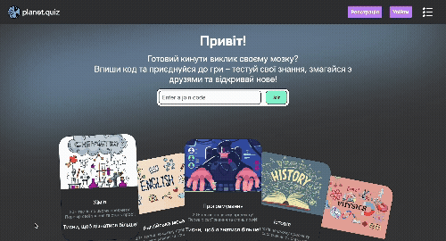
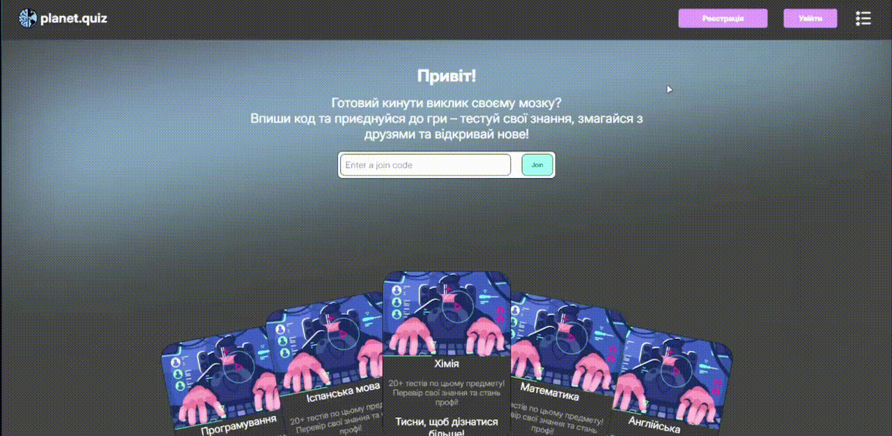
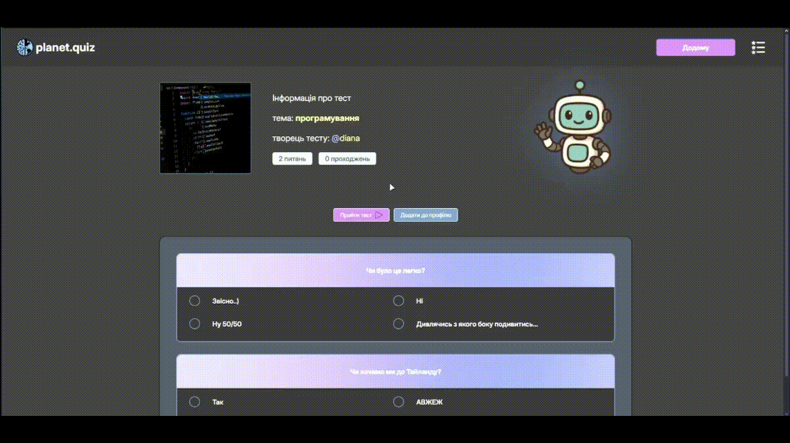
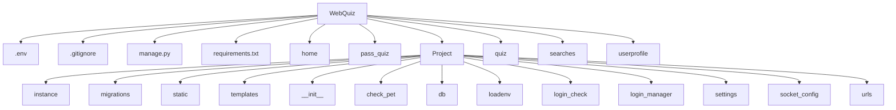

<h1>Web-Site PlanetQuiz</h1>


---

<a name="articles"><h3>Table of contents</h3></a>

# Project Description  
<h5>Опис проєкту</h5>

[Project description](#headers)

# Information about our team 
<h5>Інформація про команду</h5>

[Information about our team](#team)

# Figma
[Figma](#figmaa)

# Our project structure 
<h5>Структура проєкту</h5>

[structure of project](#structure)

# Getting Started  
<h5>Як запустити проєкт</h5>

[Getting started](#getting_started)

# Modules Description 
<h5>Опис модулей</h5> 

[Modules description](#modules)

# Package Description  
-   [Package description](#package_description) 
    - [describe home package](#home)
    - [describe pass_quiz package](#pass_quiz)
    - [describe Project package](#Project)
    - [describe quiz package](#quiz)
    - [describe searches package](#searches)
    - [describe userprofile package](#userprofile)


# Problems when creating a project
[Problems during development](#prbl_project)

# Conclusion
[Conlusion](#conclusions)

---


<a name="headers"><h1>Project description</h1></a>
Основна мета цього проєкту - закріпити та поліпшити навички роботи з базою даних та зі штучним інтелектом. Planet.quiz - це веб-застосунок на Flask для спільного та окремого проходження тестів, які можна створити самому або ж згенерувати за допомогою штучного інтелекту. Для того, щоб викладач міг поділитися створеним тестом для спільного проходження, генерується код, при введенні якого, створюється кімната де збираються всі учасники та чекають запуску самого тесту. Planet.quiz є повноцінним прикладом сучасного вебзастосунку з використанням серверного фреймворку Flask та реляційної бази даних. Він охоплює ключові аспекти бекенд- і фронтенд-розробки, логіки доступу, збереження та обробки даних, а також інтеграції зі штучним інтелектом. Також він демонструє принципи роботи з користувачами, з базою даних в якій зберігаються дані про нього, роботи з Flask та деякими бібліотеками Python. Веб-застосунок показує, як можна звʼязати та використовувати базу даних, а також як можна підключити до роботи штучний інтелект. Цей проєкт може бути корисним не лише як навчальний приклад, але й як основа для власних рішень інших розробників. Він демонструє інтеграцію ключових технологій у реальному застосунку, і тому може слугувати шаблоном для створення освітніх платформ, сервісів оцінювання або будь-яких застосунків, де потрібна перевірка знань. Код та архітектура Planet.quiz можуть бути адаптовані для різних потреб: від створення опитувальників до розгортання [SaaS-платформи](https://sendpulse.ua/support/glossary/saas#:~:text=SaaS%20—%20це%20тип%20готового%20програмного,створювати%20програми%20на%20цій%20платформі) (Software as a Service, модель яка надає можливість програмного забезпечення як послуги через інтернет, тобто працює без встановлення.), що підтримує користувацькі тести, аналітику результатів та роботу зі штучним інтелектом.


Щоб створити акаунт, потрібно:
 1. Ввести ім'я, пошту, пароль, підтвердити пароль
 2. Підтвердити пошту, отримавши та введучи код підтвердження



Проходження тесту



 
<details>
<summary> English version </summary>
To allow an instructor to share a created test for collaborative participation, a code is generated. When this code is entered, it creates a room where all participants gather and wait for the test to begin.
Planet.quiz is a fully-fledged example of a modern web application using the Flask server-side framework and a relational database. It covers key aspects of backend and frontend development, access logic, data storage and processing, as well as integration with artificial intelligence.
It also demonstrates principles of working with users, managing a database that stores user data, and using Flask along with several Python libraries. The web application shows how to connect and utilize a database and how AI can be integrated into the workflow.
This project is valuable not only as a learning example but also as a foundation for custom solutions by other developers. It showcases the integration of essential technologies in a real-world application, making it a potential template for creating educational platforms, assessment services, internal HR tools, or any applications requiring knowledge evaluation.
The code and architecture of Planet.quiz can be adapted for various purposes — from building surveys to deploying a SaaS platform (Software as a Service, a model that provides software as a service over the Internet, i.e. works without installation), that supports custom tests, result analytics, and AI functionality.


To create an account, you need to:
1. Enter your name, email, password, and confirm the password.
2. Verify your email by receiving and entering a confirmation code.

</details>

[⬆️Table of contents](#articles) 

<a name="team"><h1>Information about our team</h1></a>
1. GitHub - [Vova - Developer](https://github.com/Pranichek)
2. GitHub - [Lena - Developer](https://github.com/LenaFedchenko)
3. GitHub - [Kamilla - Designer](https://github.com/KamillaKrupina?tab=repositories)
4. GitHub - [Ivan - Developer](https://github.com/IvanKurinnyi)
5. GitHub - [Oryna - Developer](https://github.com/BoiarkinaOryna)
6. GitHub - [Diana - Developer](https://github.com/dianaaao)

[⬆️Table of contents](#articles) 


<a name="figmaa"><h1>Figma</h1></a>

[Link to Figma](https://www.figma.com/design/sJuOrHn19sOqS5AkHMeP0Y/qwwq?node-id=931-1640&t=PcuwssPDq6AUyjTa-1)


<a name="structure"><h1>Structure of project</h1></a>



[Link to project structure](https://www.figma.com/board/RoFLIAKOqf7fJ2qeNYhhb1/Untitled?node-id=0-1&p=f&t=HEQ8MiOAPdWGgcGG-0)

[⬆️Table of contents](#articles)


<a name="getting_started"><h1>Getting started</h1></a>
Нижче наведена інструкція, як запустити сайт.

## Installing python
Це приклад того, як встановити python, якщо ви ніколи ним не користуєтесь
- Завантажте інсталятор Python
 - Перейдіть на офіційний [Python website](https://www.python.org)
 - Перейдіть до розділу "Завантаження". Веб-сайт автоматично визначає вашу операційну систему та відображає відповідну версію.
- Виберіть правильну версію
 - Для більшості користувачів рекомендується остання стабільна версія. Але якщо у вас немає останньої версії, спробуйте завантажити іншу.
- Завантажте інсталятор
 - Натисніть кнопку Завантажити Python. Ця кнопка буде у верхньому правому куті екрана.
- Налаштувати параметри встановлення
 - Поставте прапорець «Додати Python до PATH» у нижній частині вікна інсталятора. Цей крок є ключовим для запуску Python з командного рядка
 - Клацніть «Налаштувати інсталяцію», якщо ви хочете вибрати додаткові параметри, але налаштування за замовчуванням добре працюють для більшості користувачів.
- Встановити python
 - Нарешті ви можете натиснути кнопку «Встановити зараз» і дочекатися завершення встановлення.
- Перевірте інсталяцію
    - Після встановлення відкрийте термінал або командний рядок.
        <details>
        <summary> Operating system</summary>
        - On Windows: Press Win + R, type cmd, and press Enter.
        - On macOS/Linux: Open the Terminal application.
        </details>
    - Тип ```python --version``` or ```python3 --version``` та натисніть Enter.
- Якщо Python встановлено правильно, ви побачите встановлену версію

Якщо ви все ще не розумієте, як встановити Python, можете подивитися [тут](https://www.youtube.com/watch?v=YKSpANU8jPE)

[⬆️Table of contents](#articles)

## Installing this project
1. Клонуйте проект
 - Перейдіть на головну сторінку проекту на github.
 - Натисніть зелену кнопку «Код», розташовану вгорі праворуч.
 - Виберіть параметр HTTPS і скопіюйте URL-адресу проекту.
2. Відкрийте проект у IDE
 - Запустіть бажану IDE (Vscode, PyCharm або іншу)
 - Відкрийте його та виберіть опцію «Відкрити папку», щоб перейти та відкрити каталог, де було клоновано проект.
 - Натисніть Control + J або просто створіть новий термінал і напишіть це:
```python
    git clone https://github.com/Pranichek/WebQuiz.git
```
3. Підготуйте проект до використання
 - Перейдіть до головної папки проекту
```python  
    cd WebQuiz
```
4. Створіть віртуальне середовище

    Для macOS/Linux:

        python3 -m venv venv
    Для Windows:

        python -m venv venv
5. Активуйте віртуальне середовище

    На macOS/Linux:

        source venv\bin\activate
    На Windows:

        venv\Scripts\activate
6. Встановити модулі проекту
 - Коли віртуальне середовище стане активним, інсталюйте необхідні бібліотеки, виконавши:

```python 
    pip install -r requirements.txt 
```

9. Також створіть модуль .env
 - Використовуйте таку команду
 mac/Linux
```python
    touch .env
```
Windows
```python
    new-item .env
```
Вставте даний код: <br>
* EMAIL_PASSWORD - вводимо пароль для пошти вашого веб-застосунку<br>
* EMAIL_USERNAME - ввести пошту за якою буде працювати ваш веб-застосунок <br>
* SECRET_KEY - вводимо секректний ключ, який використовується, для забезпечення безпеки <br>
Більше інформації про створення ключа за цим посиланням: https://propc.org.ua/?p=67
```python
    DB_INIT = flask --app Project db init 
    DB_MIGRATE = flask --app Project db migrate 
    DB_UPGRADE = flask --app Project db upgrade 

    EMAIL_PASSWORD = ''
    EMAIL_USERNAME = ''

    SECRET_KEY = ""
```


8. Запуск програми
 - Щоб запустити сайт, використовуйте таку команду:

Windows
```python
    python manage.py
```
mac/Linux
```python
    python3 manage.py
```

[⬆️Table of contents](#articles)


<a name="modules"><h1>MODULES FOR PROGRAM</h1></a>

### MODULES FOR DOWNLOADING

* **python-dotenv** — дозволяє зберігати конфіденційні дані (наприклад, API ключі, URL до БД) у .env файлі і автоматично завантажувати їх у змінні середовища Python.

* **Flask** — головний мікро-фреймворк для створення вебдодатків. Дає базову структуру: маршрути, запити, відповіді.

* **Jinja2** — шаблонізатор HTML, дозволяє динамічно генерувати сторінки у Flask через {{ ... }} і .

* **Flask-Login** — керує сесією користувача: логін, логаут, перевірка, хто увійшов.

* **Flask-Mail** — надсилання листів через SMTP(це протокол передачі листів - на нього можна залишити посилання) (реєстрація, відновлення паролю).Ми використовували для верифікація користувачів

* **Flask-Migrate** — дозволяє застосовувати міграції бази даних у Flask 

* **Flask-SQLAlchemy** — адаптер між SQLAlchemy та Flask: дозволяє працювати з БД як з Python-обʼєктами

* **Flask-SocketIO** — інтегрує WebSocket у Flask: чат, лайв-оновлення без перезавантаження.Веб сокет для обміну даних.

* **SQLAlchemy** - базовий модуль, для праці із базами даних.У нашому випадку використовувся для анотації типів даних.

* **pillow** — робота з зображеннями (відкривати, редагувати, зберігати). Використовується, наприклад, для створення аватарок.

* **pyperclip** — робота з буфером обміну (копіювати або вставити текст напряму).

* **qrcode** — генерація QR-кодів із будь-якого тексту/посилання (збереження як зображення).

* **os** - модуль, який використовується для побудови шляхів до файлів, роботи з директоріями
### BASE MODULES

* **shutil** — це вбудований модуль Python (не потребує встановлення через pip), використовувся для переміщення файлів між директоріями.

* **threading** - для створення додаткових процесів(потоків) пристроя, для відправки листів(щоб відправлялись швидше).

<a name="Project"><h1>describe Project package</h1></a>
Це основний пакет застосунку, де створюється його головний екземпляр, налаштовуються параметри роботи (через файл settings.py) та ініціалізуються ключові компоненти — такі як база даних, маршрути, логування тощо. Саме з цього місця запускається весь вебдодаток.

<h3>db.py</h3>
Налаштовує інтеграцію бази даних у Flask-додатку за допомогою бібліотек Flask-SQLAlchemy і Flask-Migrate. Він встановлює шлях до бази даних SQLite (database.db), ініціалізує об'єкт SQLAlchemy для роботи з базою через ORM, а також створює об'єкт Migrate, який відповідає за управління міграціями. Міграції зберігатимуться у папці migrations, розташованій поруч із файлом. Такий підхід дозволяє зручно змінювати структуру бази даних без втрати даних, автоматизуючи процес оновлення схеми.

<h3>login_manager.py</h3>
Цей скрипт завантажує змінні з .env файлу (наприклад, секретний ключ і облікові дані пошти), встановлює secret_key для захисту сесій і CSRF, налаштовує менеджер авторизації через Flask-Login, що дозволяє визначити, як завантажувати користувача за його ID. Також налаштовується надсилання електронних листів через SMTP-сервер Gmail із використанням TLS — це потрібно, наприклад, для реєстрації, підтвердження акаунту або відновлення паролю. Після цього створюється об'єкт Mail, який інтегрується з Flask-додатком для надсилання листів.

<h3>urls.py</h3>
Відповідає за реєстрацію маршрутів у Flask-додатку — тобто визначає, які функції обробляють запити на конкретні URL-адреси. Це фактично "карта сайту", що зв'язує веб-інтерфейс з логікою програми.

<h3>__init__.py</h3>
Відповідає за фінальну ініціалізацію та реєстрацію всіх частин застосунку Flask, об’єднуючи маршрути, налаштування, моделі й компоненти в один повноцінний вебдодаток.

<h3>cookiemodal.js</h3>
Цей JavaScript-код відповідає за відображення банера cookie та очищення локального сховища при створенні нового тесту.

<details>
<summary>English version</summary>
This is the main application package, where its main instance is created, operating parameters are configured (via the settings.py file), and key components are initialized — such as the database, routes, logging, etc. It is from this place that the entire web application is launched.
</details>

[link to file](https://github.com/Pranichek/WebQuiz/blob/main/Project/static/js/cookiemodal.js)

```python
    '''Ця функція перевіряє наявність cookie з певним значенням, і якщо такої cookie немає,
    відображає повідомлення з пропозицією прийняти умови використання файлів cookie.
    Якщо користувач натискає кнопку з id "acceptBtn", створюється cookie з назвою "cookieBy" 
    і значенням "planet.quiz", строком дії 30 днів. Таким чином, під час наступного відвідування сайту
    це повідомлення вже не з'явиться, оскільки cookie буде збережено у браузері користувача.
    Це стандартний підхід для інформування користувачів про використання cookie та отримання їхньої згоди.'''

    const executeCodes = () => {
    //if cookie contains codinglab it will be returned and below of this code will not run
    if (document.cookie.includes("planet.quiz")) return;
    cookieBox.classList.add("show");
    buttons.forEach((button) => {
        button.addEventListener("click", () => {
        cookieBox.classList.remove("show");
        //if button has acceptBtn id
        if (button.id == "acceptBtn") {
            //set cookies for 1 month. 60 = 1 min, 60 = 1 hours, 24 = 1 day, 30 = 30 days
            document.cookie = "cookieBy=planet.quiz; max-age=" + 60 * 60 * 24 * 30;
        }
        });
    });
    };

```

<h3>налаштування сокету</h3>

```python
    # Створюємо екземпляр класу SocketIO, який пов'язаний із нашим проєктом
    socket = flask_socketio.SocketIO(app = project)
```


[⬆️Table of contents](#articles)

<a name="home"><h1>home</h1></a>
<h3>views.py</h3>
Функція render_home() відповідає за показ головної сторінки неавторизованому користувачу або перенаправляє його на /home_auth, якщо вхід уже виконано. У render_home_auth() після авторизації користувач бачить персоналізовану сторінку з балансом, випадковими тестами за темами, а також останніми пройденими тестами. Додатково ця функція реагує на фільтрацію тестів або введення коду кімнати для спільного проходження. render_registration() обробляє створення нового акаунта: перевіряє правильність введених даних, наявність користувача в базі, генерує код підтвердження, зберігає дані в сесію та надсилає лист на email у фоновому потоці. Після цього render_code() перевіряє код підтвердження. Якщо все коректно — створюється новий користувач і папка з його аватаркою, копіюється стандартний аватар і виконується автоматичний вхід. Якщо ж код використовується для зміни пошти, оновлюється email і переназивається директорія зображень. render_login() реалізує процес входу: перевіряє наявність користувача, порівнює пароль і виконує вхід або виводить помилки. Весь модуль активно використовує flask.session для тимчасового зберігання даних і інтегрує Flask-Login, SQLAlchemy, Threading та файлову систему для персоналізації користувача. Цей код ілюструє, як у сучасному вебзастосунку можна реалізувати багаторівневу автентифікацію з перевіркою пошти, керуванням сесіями та зв’язком із базою даних.

[link for file](https://github.com/Pranichek/WebQuiz/blob/main/home/views.py)

```python
    '''
        Декоратор @login_decorate використовується для обмеження доступу до функції лише для авторизованих користувачів.
        Функція render_home_auth відповідає за рендеринг головної сторінки для авторизованих користувачів.
    '''
    @login_decorate
    def render_home_auth():    
        user = User.query.get(flask_login.current_user.id)

        money_user = user.user_profile.count_money

        category = ["хімія", "англійська", "математика", "історія", "програмування", "фізика", "інше"]
        first_topic = random.choice(category)
        category.remove(first_topic)
        second_topic = random.choice(category)

        first_four_test = []
        random_numbers = []

        if flask.request.method == "POST":
            check_value = flask.request.form.get("check_form")

            if check_value == "filter":
                return flask.redirect("/filter_page")
            elif check_value == "enter-room":
                data_code = flask.request.form["enter-code"]
                return flask.redirect(f"student?room_code={data_code}")

```
```python
    def send_code(recipient: str, code: int):
    '''
    Функція для відправки коду користувачу
    '''
    with project.app_context():
        msg = Message(
            subject = 'Hello from the other side!', 
            recipients = [str(recipient)] 
        )

        msg.html = f"""
            <html>
                <body>
                    <h1>Привіт, друже!</h1>
                    <p>Твій код підтвердження: {code}</p>
                </body>
            </html>
            """
        print("da")
        mail.send(msg)
```

<h3>models.py</h3>
Клас User — відповідає таблиці користувачів у базі даних. Він визначає структуру збереження інформації про користувача та логіку автентифікації/ідентифікації.
Він також інтегрується з Flask-Login, що дозволяє зручно керувати входом/виходом користувачів, сесіями та захистом доступу до маршрутів.

[link to file](https://github.com/Pranichek/WebQuiz/blob/main/home/models.py)

```python
    class User(DATABASE.Model, flask_login.UserMixin):
        __tablename__ = "user"
        id = DATABASE.Column(DATABASE.Integer, primary_key = True)

        username = DATABASE.Column(DATABASE.String(150), nullable = False)
        phone_number =  DATABASE.Column(DATABASE.Integer, nullable = False, default = "Не під'єднан")
        nickname = DATABASE.Column(DATABASE.String(150))
        password = DATABASE.Column(DATABASE.String(150), nullable = False)
        email = DATABASE.Column(DATABASE.String(150), nullable = False)
        is_mentor = DATABASE.Column(DATABASE.Boolean, default = False)
        
        name_avatar = DATABASE.Column(DATABASE.String, default = "default_avatar.svg")
        size_avatar = DATABASE.Column(DATABASE.Integer, default = 100)

        tests = DATABASE.relationship("Test", back_populates="user", lazy="dynamic")

        user_profile = DATABASE.relationship("DataUser", back_populates="user", uselist=False)

```

[⬆️Table of contents](#articles)

<a name= "userprofile"><h1>userprofile</h1><a>
<h3>models.py</h3>
Модель DataUser описує таблицю profile у базі даних, що використовується для зберігання додаткових даних про користувача, які не входять до основної таблиці user. Тут зберігається статистика: кількість пройдених тестів, кількість перемог, останні пройдені тести, а також віртуальний баланс користувача (count_money). Поле percent_bonus може використовуватись для нарахування бонусів за певний відсоток правильних відповідей у тестах, а pet_id — для зберігання ідентифікатора придбаного подарунку чи домашнього улюбленця (гейміфікація). Поле is_passing допомагає відслідковувати, чи користувач зараз проходить тест онлайн. Через поле user_id реалізовано зовнішній ключ до таблиці user, а завдяки параметру back_populates забезпечується двосторонній зв’язок один-до-одного з основною моделлю User. Така структура дозволяє розділити базову автентифікаційну інформацію від динамічної статистики користувача, забезпечуючи чисту та масштабовану архітектуру додатку.

[link to file](https://github.com/Pranichek/WebQuiz/blob/main/userprofile/views.py)

```python
    @login_decorate
    def render_test_preview(pk: int):
        """
        Обробка відображення та редагування тесту з індексом питання `pk`.

        Функція підтримує як GET-запити (для відображення прев’ю тесту),
        так і POST-запити (для збереження змін тесту, завантаження або видалення зображення).

        Основні кроки роботи:
        1. Отримання даних питань, відповідей і категорії з cookie.
        2. Обробка POST-запитів:
            - збереження оновленого тесту при відправці форми "create_test"
            - завантаження зображення для тесту при "image"
            - скидання зображення на дефолтне при "del_image"
        3. При GET-запиті підготовка даних тесту для відображення і встановлення cookie (якщо їх ще немає).
        4. Повернення підготовленої відповіді (рендер шаблону або редірект).

        Параметри:
            pk (int): параметр із індексом питання.

        Повертає:
            Flask Response: відповідь з відрендереним шаблоном або редіректом.
        """
        new_questions = ""
        new_answers = ""
        category = ""
        if flask.request.cookies.get("questions"):
            new_questions = flask.request.cookies.get("questions").encode('raw_unicode_escape').decode('utf-8')
            new_answers = flask.request.cookies.get("answers").encode('raw_unicode_escape').decode('utf-8')
            category = flask.request.cookies.get("category").encode('raw_unicode_escape').decode('utf-8')
            print("new_questions =", new_questions)

        if flask.request.method == "POST":
            check_form = flask.request.form.get('check_post')

            cookie_questions = flask.request.cookies.get("questions")
            answers_cookies = flask.request.cookies.get("answers")

            if check_form == "create_test" and cookie_questions is not None and answers_cookies is not None:
                test_title = flask.request.form["test_title"]
                question_time = flask.request.cookies.get("time").encode('raw_unicode_escape').decode('utf-8')

                test = Test.query.get(pk)
                print("test =", test)

                test.title_test = test_title
                test.questions = new_questions
                test.answers = new_answers
                test.question_time = question_time
                category = category
                image = flask.session["test_image"] if "test_image" in flask.session and flask.session["test_image"] != "default" else f"default/{return_img(category = category)}"

                test_data = TestData()
                test.test_profile = test_data

                response = flask.make_response(flask.redirect('/'))

```
[⬆️Table of contents](#articles)


<a name = "quiz"><h1>quiz</h1></a>
Модуль відповідає за створення та налаштування тесту у додатку Planet.quiz. Він включає логіку формування нового тесту, вибір теми, типу та складності запитань, а також забезпечує інтерфейс для додавання, редагування й збереження запитань у базі даних. Крім того, модуль реалізує попередній перегляд тесту перед публікацією та його збереження для подальшого проходження користувачами.


[link to file](https://github.com/Pranichek/WebQuiz/blob/main/quiz/views.py)

```python
    '''
        Перевіряємо, чи існує папка cash_test для конкретного користувача (використовується його email).
        Якщо такої директорії ще немає, створюємо її.
        Повний шлях формується відносно поточного файлу (__file__), піднімаючись на два рівні вверх,
        далі переходячи до 'userprofile/static/images/edit_avatar/[email]/cash_test'
    '''

    if not exists(abspath(join(__file__, "..", "..", "userprofile", "static", "images", "edit_avatar", str(current_user.email), "cash_test"))):
        os.mkdir(abspath(join(__file__, "..", "..", "userprofile", "static", "images", "edit_avatar", str(current_user.email), "cash_test")))

    flask.session["test_image"] = str(image.filename)
    delete_files_in_folder(abspath(join(__file__, "..", "..", "userprofile", "static", "images", "edit_avatar", str(current_user.email),  "cash_test")))
    image.save(abspath(join(__file__, "..", "..", "userprofile", "static", "images", "edit_avatar", str(current_user.email),  "cash_test", str(image.filename))))

```
Функція render_test відповідає за створення та попередній перегляд тесту. Вона зчитує питання, відповіді, категорію та зображення з cookie, обробляє форму для збереження тесту (створює запис у базі, зберігає зображення користувача), а також відображає сторінку з поточним набором питань і відповідей для подальшого редагування або перевірки.

[⬆️Table of contents](#articles)


<a name = "pass_quiz"><h1>pass_quiz</h1></a>
Цей папка (пакет) є складовою частиною веб-застосунку, що реалізує систему тестування користувачів. 
У ньому зібрано повну логіку, пов’язану з процесом проходження тесту, а також опрацюванням 
результатів після завершення тесту. Код базується на фреймворку Flask та розширюється за 
допомогою Flask-SocketIO для підтримки реального часу. У ньому реалізовано повний цикл роботи з тестами: від відображення інтерфейсу для різних типів користувачів (студент, ментор) до обробки результатів після завершення тесту з використанням WebSocket-з'єднання.

<h4>views.py</h4>

[link to file](https://github.com/Pranichek/WebQuiz/blob/main/pass_quiz/views.py)

```python
    '''
        Декоратор @socket.on("copy_result") означає, що ця функція буде виконуватися,
        коли клієнт надішле подію з назвою "copy_result" через WebSocket.
    '''
    @socket.on("copy_result")
    def coput_result_function(data):    
        test_id = int(data["test_id"])
        test : Test = Test.query.get(test_id)

        test_question = test.questions.split("?%?")
        count_questions_test = len(test_question)
        
        test_text = "📋 Результати мого тесту:\n🧪 Назва тесту: {}\n✅ Правильних відповідей: {} з {}\n📈 Результат: {}\n⏱ Час проходження: {}".format(
            test.title_test,
            data["correct_answers"],
            count_questions_test,
            data["accuracy"],
            data["wasted_time"]
        )

        pyperclip.copy(test_text)

```

[⬆️Table of contents](#articles)

<a name = "searches"><h1>searches</h1></a>
Модуль реалізує логіку пошуку в рамках веб-застосунку. Вона відповідає за функціональність, яка дозволяє користувачам шукати тести за їх назвою. Це важливий компонент у системі, де кількість тестів зростає, і зручний пошук стає необхідним для швидкого доступу до потрібного контенту.

Після введення користувачем пошукового запиту, застосунок обробляє цей запит, знаходить відповідні тести (якщо вони існують), фільтрує ті, що були позначені як видалені, та відображає результати у вигляді списку на окремій сторінці.

[link to file](https://github.com/Pranichek/WebQuiz/blob/main/searches/views.py)

```python
    @login_decorate
    def render_data_filter():
        input_data = flask.request.args.get("input_data")
        print(input_data, "fd")
        searching_test = []
        user = ''

        if input_data is not None:
            tests = Test.query.filter(Test.check_del != "deleted").all()

            if len(tests) > 0:
                for test in tests:
                    title = test.title_test.strip().lower()
                    if title.startswith(input_data): 
                        searching_test.append(test)
            print(searching_test)

        return flask.render_template(
            template_name_or_list = "search.html",
            searching_test = searching_test
        )
```
[⬆️Table of contents](#articles)


<a name="prbl_project"><h2>Problems during development</h2></a>
Під час створення нашого вебсайту ми зіштовхнулися з рядом викликів, які стали для нас важливим етапом у професійному зростанні. Проєктування та реалізація сайту вимагали не лише технічних знань, а й вміння організовувати роботу в команді, планувати час та дотримуватися дедлайнів.

Однією з основних проблем стало впровадження адаптивної верстки. Забезпечити коректне відображення сторінок на різних пристроях — комп’ютерах, планшетах, смартфонах — виявилося складнішим, ніж ми очікували. Ми не одразу врахували важливість мобільної оптимізації, тож частину роботи довелося переробляти. Використання медіа-запитів, гнучких сіток та адаптивних елементів дало нам змогу зрозуміти, наскільки важливо враховувати всі можливі сценарії взаємодії користувача з сайтом.

Ще одна складність полягала у початково невдало вибраній структурі проєкту. Через відсутність чіткої архітектури ми витрачали більше часу на навігацію у файлах, дублювали частину коду і стискалися з труднощами при масштабуванні функціоналу. Згодом ми усвідомили важливість правильного поділу на компоненти, зручної іменної структури та коментування коду.

Окремо варто згадати про часові труднощі. Через відсутність регулярної взаємодії на початку роботи над проєктом, активна фаза розробки розпочалась запізно. Це змусило нас працювати інтенсивніше у короткий проміжок часу, іноді навіть у позаурочний час. Попри втому, команда показала згуртованість і бажання досягти спільної мети.

Особливо відчутними ці труднощі стали для студентів першого курсу. Для багатьох з них це був перший досвід серйозної роботи з HTML, CSS та JavaScript. Потрібно було не тільки вивчити синтаксис і правила мови, а й навчитися застосовувати знання на практиці: створювати структуру сторінки, стилізувати елементи, реалізовувати логіку взаємодії користувача з інтерфейсом. Це вимагало чималих зусиль, терпіння й наполегливості.

Незважаючи на всі труднощі, участь у створенні сайту стала цінною можливістю для професійного зростання. Ми отримали безцінний досвід роботи в команді, розвинули свої навички з веброзробки, навчились долати технічні та організаційні бар’єри. Проєкт став чудовим прикладом того, як спільна робота та мотивація здатні привести до досягнення поставлених цілей.

<details>
<summary>English version</summary>
During the creation of our website, we encountered a number of challenges that became an important stage in our professional growth. Designing and implementing the site required not only technical knowledge but also the ability to organize teamwork, plan time effectively, and meet deadlines.

One of the main issues we faced was implementing responsive design. Ensuring that pages displayed correctly on various devices—computers, tablets, and smartphones—turned out to be more difficult than we initially expected. We did not immediately recognize the importance of mobile optimization, so part of the work had to be redone. The use of media queries, flexible grids, and responsive elements helped us understand how crucial it is to consider all possible user interaction scenarios.

Another challenge was the poorly chosen initial structure of the project. Due to the lack of a clear architecture, we spent more time navigating files, duplicating code, and encountering difficulties when trying to scale functionality. Eventually, we realized the importance of proper component separation, consistent naming conventions, and thorough code documentation.

We also faced time-related difficulties. Due to a lack of regular communication at the start of the project, the active development phase began later than planned. This forced us to work more intensively in a short amount of time, sometimes even outside of regular hours. Despite the fatigue, the team demonstrated cohesion and a strong commitment to achieving our common goal.

These challenges were particularly noticeable for first-year students. For many of them, this was their first experience working seriously with HTML, CSS, and JavaScript. They had to not only learn the syntax and rules of the languages but also apply that knowledge in practice: creating page structures, styling elements, and implementing user interface logic. This required significant effort, patience, and perseverance.

Despite all the difficulties, participating in the website development project was a valuable opportunity for professional development. We gained invaluable experience working as a team, improved our web development skills, and learned to overcome technical and organizational obstacles. The project became a great example of how collaboration and motivation can lead to the successful achievement of goals.
</details>


<a name="conclusions"><h2>Conclusion</h2></a>
У підсумку, робота над цим проєктом стала для нашої команди не лише технічним викликом, а й чудовою можливістю для особистого та професійного зростання. Ми навчилися ефективно співпрацювати, розподіляти обов’язки, вирішувати складні завдання та знаходити компроміси. Кожен з нас отримав цінний досвід у розробці сучасних вебзастосунків, поглибив знання з Python, Flask, роботи з базами даних та інтеграції зі сторонніми сервісами. Ми пишаємося результатом і впевнені, що цей проєкт стане гарною основою для подальших розробок та натхненням для інших студентів!
<details>
<summary>English version</summary>
In conclusion, working on this project was not only a technical challenge for our team but also a great opportunity for personal and professional growth. We learned how to collaborate effectively, distribute responsibilities, solve complex problems, and find compromises. Each of us gained valuable experience in developing modern web applications, deepened our knowledge of Python, Flask, working with databases, and integrating third-party services. We are proud of the result and confident that this project will serve as a solid foundation for future developments and as inspiration for other students!
</details>
 
[⬆️Table of contents](#articles)