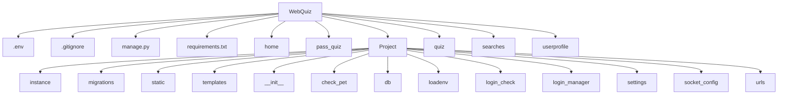

<h1>Web-Site "PlanetQuiz"</h1>

---

<a name="articles"><h3>Table of contents</h3></a>

# Project Description  
[Project description](#headers)

# Information about our team 
[Information about our team](#team)

# Figma
[Figma](#figmaa)

# Our project structure  
[structure of project](#structure)

# Getting Started  
[Getting started](#getting_started)

# Modules Description  
[Modules description](#modules)

# Package Description  
-   [Package description](#package_description) 
    - [describe home package](#home)
    - [describe pass_quiz package](#pass_quiz)
    - [describe Project package](#Project)
    - [describe quiz package](#quiz)
    - [describe searches package](#searches)
    - [describe userprofile package](#userprofile)
- [.env package modules](#env)
- [.gitignore package modules](#gitignore)
- [manage.py modules](#manage)


# Problems when creating a project
[Problems during development](#prbl_project)

# Conclusion
[Conlusion](#conclusions)

---


<a name="headers"><h1>Project description</h1></a>
Основна мета цього проєкту - закріпити та поліпшити навички роботи з базою даних та зі штучним інтелектом. Planet.quiz - це веб-застосунок на Flask для спільного та окремого проходження тестів, які можна створити самому або ж згенерувати за допомогою штучного інтелекту. Для того, щоб викладач міг поділитися створеним тестом для спільного проходження, генерується код, при введенні якого, створюється кімната де збираються всі учасники та чекають запуску самого тесту. Planet.quiz є повноцінним прикладом сучасного вебзастосунку з використанням серверного фреймворку Flask та реляційної бази даних. Він охоплює ключові аспекти бекенд- і фронтенд-розробки, логіки доступу, збереження та обробки даних, а також інтеграції зі штучним інтелектом. Також він демонструє принципи роботи з користувачами, з базою даних в якій зберігаються дані про нього, роботи з Flask та деякими бібліотеками Python. Веб-застосунок показує, як можна звʼязати та використовувати базу даних, а також як можна підключити до роботи штучний інтелект. Цей проєкт може бути корисним не лише як навчальний приклад, але й як основа для власних рішень інших розробників. Він демонструє інтеграцію ключових технологій у реальному застосунку, і тому може слугувати шаблоном для створення освітніх платформ, сервісів оцінювання, внутрішніх HR-інструментів або будь-яких застосунків, де потрібна перевірка знань. Код та архітектура Planet.quiz можуть бути адаптовані для різних потреб: від створення опитувальників до розгортання SaaS-платформи, що підтримує користувацькі тести, аналітику результатів та роботу зі штучним інтелектом.


Щоб створити акаунт, потрібно:
 1. Ввести ім'я, пошту, пароль, підтвердити пароль
 2. Підтвердити пошту, отримавши та введучи код підтвердження


 
 
<details>
<summary> English version </summary>
To allow an instructor to share a created test for collaborative participation, a code is generated. When this code is entered, it creates a room where all participants gather and wait for the test to begin.
Planet.quiz is a fully-fledged example of a modern web application using the Flask server-side framework and a relational database. It covers key aspects of backend and frontend development, access logic, data storage and processing, as well as integration with artificial intelligence.
It also demonstrates principles of working with users, managing a database that stores user data, and using Flask along with several Python libraries. The web application shows how to connect and utilize a database and how AI can be integrated into the workflow.
This project is valuable not only as a learning example but also as a foundation for custom solutions by other developers. It showcases the integration of essential technologies in a real-world application, making it a potential template for creating educational platforms, assessment services, internal HR tools, or any applications requiring knowledge evaluation.
The code and architecture of Planet.quiz can be adapted for various purposes — from building surveys to deploying a SaaS platform that supports custom tests, result analytics, and AI functionality.


To create an account, you need to:
1. Enter your name, email, password, and confirm the password.
2. Verify your email by receiving and entering a confirmation code.

</details>

[⬆️Table of contents](#articles) 

<a name="team"><h1>Information about our team</h1></a>
1. GitHub - [Vova - Developer](https://github.com/Pranichek)
2. GitHub - [Lena - Developer](https://github.com/LenaFedchenko)
3. GitHub - [Kamilla - Designer](https://github.com/KamillaKrupina?tab=repositories)
4. GitHub - [Ivan - Developer](https://github.com/IvanKurinnyi)
5. GitHub - [Oryna - Developer](https://github.com/BoiarkinaOryna)
6. GitHub - [Diana - Developer](https://github.com/dianaaao)

[⬆️Table of contents](#articles) 


<a name="figmaa"><h1>Figma</h1></a>

[Link to Figma](https://www.figma.com/design/sJuOrHn19sOqS5AkHMeP0Y/qwwq?node-id=931-1640&t=PcuwssPDq6AUyjTa-1)


<a name="structure"><h1>Structure of project</h1></a>


```mermaid
    graph TD;
        WebQuiz-->.env;
        WebQuiz-->.gitignore;
        WebQuiz-->manage.py;
        WebQuiz-->requirements.txt;
        WebQuiz-->home;
        WebQuiz-->pass_quiz;
        WebQuiz-->Project;
        WebQuiz-->quiz;
        WebQuiz-->searches;
        WebQuiz-->userprofile;
        Project-->instance;
        Project-->migrations;
        Project-->static;
        Project-->templates;
        Project-->__init__;
        Project-->check_pet;
        Project-->db;
        Project-->loadenv;
        Project-->login_check;
        Project-->login_manager;
        Project-->settings;
        Project-->socket_config;
        Project-->urls;
```

[Link to project structure](https://www.figma.com/board/RoFLIAKOqf7fJ2qeNYhhb1/Untitled?node-id=0-1&p=f&t=HEQ8MiOAPdWGgcGG-0)

[⬆️Table of contents](#articles)


<a name="getting_started"><h1>Getting started</h1></a>
Нижче наведена інструкція, як запустити сайт.

## Installing python
Це приклад того, як встановити python, якщо ви ніколи ним не користуєтесь
- Завантажте інсталятор Python
 - Перейдіть на офіційний [Python website](https://www.python.org)
 - Перейдіть до розділу "Завантаження". Веб-сайт автоматично визначає вашу операційну систему та відображає відповідну версію.
- Виберіть правильну версію
 - Для більшості користувачів рекомендується остання стабільна версія. Але якщо у вас немає останньої версії, спробуйте завантажити іншу.
- Завантажте інсталятор
 - Натисніть кнопку Завантажити Python. Ця кнопка буде у верхньому правому куті екрана.
- Налаштувати параметри встановлення
 - Поставте прапорець «Додати Python до PATH» у нижній частині вікна інсталятора. Цей крок є ключовим для запуску Python з командного рядка
 - Клацніть «Налаштувати інсталяцію», якщо ви хочете вибрати додаткові параметри, але налаштування за замовчуванням добре працюють для більшості користувачів.
- Встановити python
 - Нарешті ви можете натиснути кнопку «Встановити зараз» і дочекатися завершення встановлення.
- Перевірте інсталяцію
    - Після встановлення відкрийте термінал або командний рядок.
        <details>
        <summary> Operating system</summary>
        - On Windows: Press Win + R, type cmd, and press Enter.
        - On macOS/Linux: Open the Terminal application.
        </details>
    - Тип ```python --version``` or ```python3 --version``` та натисніть Enter.
- Якщо Python встановлено правильно, ви побачите встановлену версію

Якщо ви все ще не розумієте, як встановити Python, можете подивитися [тут](https://www.youtube.com/watch?v=YKSpANU8jPE)

[⬆️Table of contents](#articles)

## Installing this project
1. Клонуйте проект
 - Перейшов на головну сторінку проекту на github.
 - Натисніть зелену кнопку «Код», розташовану вгорі праворуч.
 - Виберіть параметр HTTPS і скопіюйте URL-адресу проекту.
2. Відкрийте проект у IDE
 - Запустіть бажану IDE (Vscode, PyCharm або іншу)
 - Відкрийте його та виберіть опцію «Відкрити папку», щоб перейти та відкрити каталог, де було клоновано проект.
 - Натисніть Control + J або просто створіть новий термінал і напишіть це:
```python
    git clone https://github.com/Pranichek/WebQuiz.git
```
3. Підготуйте проект до використання
 - Перейдіть до головної папки проекту
```python  
    cd WebQuiz
```
4. Створіть віртуальне середовище

    Для macOS/Linux:

        python3 -m venv venv
    Для Windows:

        python -m venv venv
5. Активуйте віртуальне середовище

    На macOS/Linux:

        source venv\bin\activate
    На Windows:

        venv\Scripts\activate
6. Встановити модулі проекту
 - Коли віртуальне середовище стане активним, інсталюйте необхідні бібліотеки, виконавши:

```python 
    pip install -r requirements.txt 
```

9. Також створіть модуль .env
 - Використовуйте таку команду
```python
    touch .env
```
Вставте даний код
```python
    DB_INIT = flask --app Project db init 
    DB_MIGRATE = flask --app Project db migrate 
    DB_UPGRADE = flask --app Project db upgrade 

    EMAIL_PASSWORD = 'xlct novj oxku qexm'
    EMAIL_USERNAME = 'flasktestver@gmail.com'

    SECRET_KEY = "0fdc69309f198e8d93aea4b8b773b545cdcb42897d394be9a3f9b095d7a258e9"
```
У терміналі вставте дані рядки коду 
```python
    flask --app Project db init 
    flask --app Project db migrate 
    flask --app Project db upgrade 
```


8. Запуск програми
 - Щоб запустити сайт, використовуйте таку команду:

```python
    python manage.py
```


[⬆️Table of contents](#articles)


<a name="modules"><h1>MODULES FOR PROGRAM</h1></a>

### MODULES FOR DOWNLOADING

* **python-dotenv** — дозволяє зберігати конфіденційні дані (наприклад, API ключі, URL до БД) у .env файлі і автоматично завантажувати їх у змінні середовища Python.

* **Flask** — головний мікро-фреймворк для створення вебдодатків. Дає базову структуру: маршрути, запити, відповіді.

* **Jinja2** — шаблонізатор HTML, дозволяє динамічно генерувати сторінки у Flask через {{ ... }} і .

* **Flask-Login** — керує сесією користувача: логін, логаут, перевірка, хто увійшов.

* **Flask-Mail** — надсилання листів через SMTP(це протокол передачі листів - на нього можна залишити посилання) (реєстрація, відновлення паролю).Ми використовували для верифікація користувачів

* **Flask-Migrate** — дозволяє застосовувати міграції бази даних у Flask 

* **Flask-SQLAlchemy** — адаптер між SQLAlchemy та Flask: дозволяє працювати з БД як з Python-обʼєктами

* **Flask-SocketIO** — інтегрує WebSocket у Flask: чат, лайв-оновлення без перезавантаження.Веб сокет для обміну даних.

* **SQLAlchemy** - базовий модуль, для праці із базами даних.У нашому випадку використовувся для анотації типів даних.

* **pillow** — робота з зображеннями (відкривати, редагувати, зберігати). Використовується, наприклад, для створення аватарок.

* **pyperclip** — робота з буфером обміну (копіювати або вставити текст напряму).

* **qrcode** — генерація QR-кодів із будь-якого тексту/посилання (збереження як зображення).
### BASE MODULES

* **shutil** — це вбудований модуль Python (не потребує встановлення через pip), використовувся для переміщення файлів між директоріями.

* **threading** - для створення додаткових процесів(потоків) пристроя, для відправки листів(щоб відправлялись швидше).

<a name="Project"><h1>describe Project package</h1></a>
Це основний пакет застосунку, де створюється його головний екземпляр, налаштовуються параметри роботи (через файл settings.py) та ініціалізуються ключові компоненти — такі як база даних, маршрути, логування тощо. Саме з цього місця запускається весь вебдодаток.

<h3>db.py</h3>
налаштовує інтеграцію бази даних у Flask-додатку за допомогою бібліотек Flask-SQLAlchemy і Flask-Migrate. Він встановлює шлях до бази даних SQLite (database.db), ініціалізує об'єкт SQLAlchemy для роботи з базою через ORM, а також створює об'єкт Migrate, який відповідає за управління міграціями. Міграції зберігатимуться у папці migrations, розташованій поруч із файлом. Такий підхід дозволяє зручно змінювати структуру бази даних без втрати даних, автоматизуючи процес оновлення схеми.

<h3>login_manager.py</h3>
Цей скрипт завантажує змінні з .env файлу (наприклад, секретний ключ і облікові дані пошти), встановлює secret_key для захисту сесій і CSRF, налаштовує менеджер авторизації через Flask-Login, що дозволяє визначити, як завантажувати користувача за його ID. Також налаштовується надсилання електронних листів через SMTP-сервер Gmail із використанням TLS — це потрібно, наприклад, для реєстрації, підтвердження акаунту або відновлення паролю. Після цього створюється об'єкт Mail, який інтегрується з Flask-додатком для надсилання листів.

<h3>urls.py</h3>
відповідає за реєстрацію маршрутів у Flask-додатку — тобто визначає, які функції обробляють запити на конкретні URL-адреси. Це фактично "карта сайту", що зв'язує веб-інтерфейс з логікою програми.

<h3>__init__.py</h3>
відповідає за фінальну ініціалізацію та реєстрацію всіх частин застосунку Flask, об’єднуючи маршрути, налаштування, моделі й компоненти в один повноцінний вебдодаток.

<h3>cookiemodal.js</h3>
Цей JavaScript-код відповідає за відображення банера cookie та очищення локального сховища при створенні нового тесту.

<!--  -->

<details>
<summary>English version</summary>
This is the main application package, where its main instance is created, operating parameters are configured (via the settings.py file), and key components are initialized — such as the database, routes, logging, etc. It is from this place that the entire web application is launched.
</details>

```python
    def execute():
    # Визначаємо абсолютні шляхи до .env файлу та папки міграцій
    ENV_PATH = abspath(join(__file__, "..", "..", ".env"))
    MIGRATIONS_PATH = abspath(join(__file__, "..", "migrations"))

    # Якщо файл .env існує — завантажуємо змінні середовища
    if exists(ENV_PATH):
        dotenv.load_dotenv(dotenv_path = ENV_PATH)

        # Якщо папка з міграціями не існує — ініціалізуємо її командою з оточення
        if not exists(MIGRATIONS_PATH):
            os.system(os.environ["DB_INIT"])

        # Виконуємо команди міграції та оновлення бази даних
        os.system(os.environ["DB_MIGRATE"])
        os.system(os.environ["DB_UPGRADE"])
```
```python
    # Створюємо екземпляр класу SocketIO, який пов'язаний із нашим проєктом
    socket = flask_socketio.SocketIO(app = project)
```


[⬆️Table of contents](#articles)

<a name="home"><h1>home</h1></a>
<h1>views.py</h1>
Функція render_home() відповідає за показ головної сторінки неавторизованому користувачу або перенаправляє його на /home_auth, якщо вхід уже виконано. У render_home_auth() після авторизації користувач бачить персоналізовану сторінку з балансом, випадковими тестами за темами, а також останніми пройденими тестами. Додатково ця функція реагує на фільтрацію тестів або введення коду кімнати для спільного проходження. render_registration() обробляє створення нового акаунта: перевіряє правильність введених даних, наявність користувача в базі, генерує код підтвердження, зберігає дані в сесію та надсилає лист на email у фоновому потоці. Після цього render_code() перевіряє код підтвердження. Якщо все коректно — створюється новий користувач і папка з його аватаркою, копіюється стандартний аватар і виконується автоматичний вхід. Якщо ж код використовується для зміни пошти, оновлюється email і переназивається директорія зображень. render_login() реалізує процес входу: перевіряє наявність користувача, порівнює пароль і виконує вхід або виводить помилки. Весь модуль активно використовує flask.session для тимчасового зберігання даних і інтегрує Flask-Login, SQLAlchemy, Threading та файлову систему для персоналізації користувача. Цей код ілюструє, як у сучасному вебзастосунку можна реалізувати багаторівневу автентифікацію з перевіркою пошти, керуванням сесіями та зв’язком із базою даних.

```python
    #головна сторінка коли користувач увійшов у акаунт
    @login_decorate
    def render_home_auth():    
        user = User.query.get(flask_login.current_user.id)

        # отримати баланс
        money_user = user.user_profile.count_money

        category = ["хімія", "англійська", "математика", "історія", "програмування", "фізика", "інше"]
        first_topic = random.choice(category)
        category.remove(first_topic)
        second_topic = random.choice(category)

        first_four_test = []
        random_numbers = []

        if flask.request.method == "POST":
            check_value = flask.request.form.get("check_form")

            if check_value == "filter":
                return flask.redirect("/filter_page")
            elif check_value == "enter-room":
                data_code = flask.request.form["enter-code"]
                return flask.redirect(f"student?room_code={data_code}")

        tests_first_topic = Test.query.filter(Test.category == first_topic, Test.check_del != "deleted").all()
        if len(tests_first_topic) > 0:
            while True:
                random_num = random.randint(0, len(tests_first_topic) - 1)
                if random_num not in random_numbers and tests_first_topic[random_num].check_del != "deleted":
                    random_numbers.append(random_num)
                if len(random_numbers) == len(tests_first_topic) or len(random_numbers) >= 4:
                    break
            print(random_numbers)
            for num in random_numbers:
                first_four_test.append(tests_first_topic[num])

        second_four_test = []
        second_random_numbers = []

        # tests_second_topic = Test.query.filter_by(category = second_topic).all()
        tests_second_topic = Test.query.filter(Test.category == second_topic, Test.check_del != "deleted").all()
        if len(tests_second_topic) > 0:
            while True:
                random_num = random.randint(0, len(tests_second_topic) - 1)
                if random_num not in second_random_numbers and tests_second_topic[random_num].check_del != "deleted":
                    second_random_numbers.append(random_num)
                if len(second_random_numbers) == len(tests_second_topic) or len(second_random_numbers) >= 4:
                    break
            for num in second_random_numbers:
                second_four_test.append(tests_second_topic[num])


        user : User = User.query.get(int(current_user.id))
        third_random_numbers = user.user_profile.last_passed.split(" ")
        all_tests = Test.query.all()

        third_ready_tests = []

        if '' in third_random_numbers:
            third_random_numbers.remove('')
        for test in range(0, len(third_random_numbers)):
            if Test.query.get(int(third_random_numbers[test])).check_del != "deleted":
                third_ready_tests.append(Test.query.get(int(third_random_numbers[test])))
    
        return flask.render_template(
            "home_auth.html", 
            home_auth = True,
            count_tests = 0,
            user = user,
            first_tests = first_four_test,
            first_topic = first_topic,
            second_topic = second_topic,
            second_tests = second_four_test,
            third_tests = third_ready_tests
            )

```
```python
    def send_code(recipient: str, code: int):
    '''
    Функція для відправки коду користувачу
    '''
    with project.app_context():
        msg = Message(
            subject = 'Hello from the other side!', 
            recipients = [str(recipient)] 
        )

        msg.html = f"""
            <html>
                <body>
                    <h1>Привіт, друже!</h1>
                    <p>Твій код підтвердження: {code}</p>
                </body>
            </html>
            """
        print("da")
        mail.send(msg)
```

<h1>models.py</h1>
Цей клас User визначає модель користувача у Flask-додатку Planet.quiz, використовуючи SQLAlchemy як ORM та інтеграцію з Flask-Login для керування автентифікацією. 

<h1></h1>

[⬆️Table of contents](#articles)

<a name= "userprofile"><h1>userprofile</h1><a>
<h1>models.py</h1>
Модель DataUser описує таблицю profile у базі даних, що використовується для зберігання додаткових даних про користувача, які не входять до основної таблиці user. Тут зберігається статистика: кількість пройдених тестів, кількість перемог, останні пройдені тести, а також віртуальний баланс користувача (count_money). Поле percent_bonus може використовуватись для нарахування бонусів за певний відсоток правильних відповідей у тестах, а pet_id — для зберігання ідентифікатора придбаного подарунку чи домашнього улюбленця (гейміфікація). Поле is_passing допомагає відслідковувати, чи користувач зараз проходить тест онлайн. Через поле user_id реалізовано зовнішній ключ до таблиці user, а завдяки параметру back_populates забезпечується двосторонній зв’язок один-до-одного з основною моделлю User. Така структура дозволяє розділити базову автентифікаційну інформацію від динамічної статистики користувача, забезпечуючи чисту та масштабовану архітектуру додатку.

```python
    @login_decorate
    def render_test_preview(pk: int):
        """
        Обробка відображення та редагування тесту з первинним ключем `pk`.

        Функція підтримує як GET-запити (для відображення прев’ю тесту),
        так і POST-запити (для збереження змін тесту, завантаження або видалення зображення).

        Основні кроки роботи:
        1. Отримання даних питань, відповідей і категорії з cookie.
        2. Обробка POST-запитів:
            - збереження оновленого тесту при відправці форми "create_test"
            - завантаження зображення для тесту при "image"
            - скидання зображення на дефолтне при "del_image"
        3. При GET-запиті підготовка даних тесту для відображення і встановлення cookie (якщо їх ще немає).
        4. Повернення підготовленої відповіді (рендер шаблону або редірект).

        Параметри:
            pk (int): первинний ключ тесту у базі даних.

        Повертає:
            Flask Response: відповідь з відрендереним шаблоном або редіректом.
        """
        new_questions = ""
        new_answers = ""
        category = ""
        if flask.request.cookies.get("questions"):
            new_questions = flask.request.cookies.get("questions").encode('raw_unicode_escape').decode('utf-8')
            new_answers = flask.request.cookies.get("answers").encode('raw_unicode_escape').decode('utf-8')
            category = flask.request.cookies.get("category").encode('raw_unicode_escape').decode('utf-8')
            print("new_questions =", new_questions)

        if flask.request.method == "POST":
            check_form = flask.request.form.get('check_post')

            cookie_questions = flask.request.cookies.get("questions")
            answers_cookies = flask.request.cookies.get("answers")

            if check_form == "create_test" and cookie_questions is not None and answers_cookies is not None:
            # if cookie_questions is not None and answers_cookies is not None:
                test_title = flask.request.form["test_title"]
                question_time = flask.request.cookies.get("time").encode('raw_unicode_escape').decode('utf-8')

                test = Test.query.get(pk)
                print("test =", test)

                test.title_test = test_title
                test.questions = new_questions
                test.answers = new_answers
                test.question_time = question_time
                category = category
                image = flask.session["test_image"] if "test_image" in flask.session and flask.session["test_image"] != "default" else f"default/{return_img(category = category)}"

                test_data = TestData()
                test.test_profile = test_data

                response = flask.make_response(flask.redirect('/'))

                try:
                    response.delete_cookie("questions")
                    response.delete_cookie("answers")
                    response.delete_cookie("time")
                    response.delete_cookie("category")
                    response.delete_cookie("inputname")
                    response.delete_cookie("test_url")
                    response.delete_cookie("images")
                except:
                    pass

                DATABASE.session.commit()
                return response
            elif check_form == "image":
                image = flask.request.files["image"]
        
                if not exists(abspath(join(__file__, "..", "..", "userprofile", "static", "images", "edit_avatar", str(current_user.email), "cash_test"))):
                    os.mkdir(abspath(join(__file__, "..", "..", "userprofile", "static", "images", "edit_avatar", str(current_user.email), "cash_test")))

                flask.session["test_image"] = str(image.filename)
                delete_files_in_folder(abspath(join(__file__, "..", "..", "userprofile", "static", "images", "edit_avatar", str(current_user.email),  "cash_test")))
                image.save(abspath(join(__file__, "..", "..", "userprofile", "static", "images", "edit_avatar", str(current_user.email),  "cash_test", str(image.filename))))
            elif check_form == "del_image":
                flask.session["test_image"] = "default"

        else:

            response = flask.make_response()
            test = Test.query.get(pk)

            category = test.category.encode('utf-8').decode('unicode_escape')
            print("test =", category)

            list_to_template = []
            # new_questions_list = test.questions.split("?%?")
            # new_answers_list = test.answers.split("?@?")
            # new_time_list = test.question_time.split("?#?")
            new_answers_list = new_answers.split("?@?")
            new_questions_list = new_questions.split("?%?")

            number = 0
            for question in new_questions_list:
                item = {}
                item["question"] = question
                answers_list = new_answers_list[number].split("%?)(?%")
                temporary_answers_list = []
                for answer in answers_list:
                    answer = answer.replace("(?%", "")
                    answer = answer.replace("%?)", "")
                    answer = answer[1:-1]
                    temporary_answers_list.append(answer)
                item["answers"] = temporary_answers_list
                item["pk"] = number
                # item["time"] = new_time_list[number]
                list_to_template.append(item)
                number += 1
            print("list_to_template", list_to_template)

            response = flask.make_response(
                flask.render_template(
                    template_name_or_list = "test_preview.html",
                    test = test,
                    user = flask_login.current_user,
                    question_list = list_to_template
                )
            )
            if not flask.request.cookies.get("questions"):
                response.set_cookie('questions', test.questions)
                response.set_cookie('answers', test.answers)
                response.set_cookie('time', test.question_time)
                response.set_cookie('category', category)
                response.set_cookie('inputname', test.title_test)

        return response
```
[⬆️Table of contents](#articles)


<a name = "quiz"><h1>quiz</h1></a>
Папка відповідає за створення/налаштування тесту

```python
    @login_decorate
    def render_test():
        list_to_template = []
        new_questions = ""
        new_answers = ""
        category = ""
        name_image = ''
        try:
            new_questions = flask.request.cookies.get("questions").encode('raw_unicode_escape').decode('utf-8')
            new_answers = flask.request.cookies.get("answers").encode('raw_unicode_escape').decode('utf-8')
            category = flask.request.cookies.get("category").encode('raw_unicode_escape').decode('utf-8')
            name_image = flask.request.cookies.get("test_url").encode('raw_unicode_escape').decode('utf-8')
        except:
            pass


        if flask.request.method == "POST":
            check_form = flask.request.form.get('check_post')

            cookie_questions = flask.request.cookies.get("questions")
            answers_cookies = flask.request.cookies.get("answers")

            if check_form == "create_test" and cookie_questions is not None and answers_cookies is not None:
                # print(name_image, "name")
                test_title = flask.request.form["test_title"]
                question_time = flask.request.cookies.get("time").encode('raw_unicode_escape').decode('utf-8')

                test = Test(
                    title_test = test_title,
                    questions = new_questions,
                    answers = new_answers,
                    question_time = question_time,
                    user_id = flask_login.current_user.id,
                    category = category,
                    image = flask.session["test_image"] if "test_image" in flask.session and flask.session["test_image"] != "default" else f"default/{return_img(category = category)}"
                )

                test_data = TestData()
                test.test_profile = test_data

                response = flask.make_response(flask.redirect('/'))

                try:
                    response.delete_cookie("questions")
                    response.delete_cookie("answers")
                    response.delete_cookie("time")
                    response.delete_cookie("category")
                    response.delete_cookie("inputname")
                    response.delete_cookie("test_url")
                    response.delete_cookie("images")
                except:
                    pass

                # try:
                if not exists(abspath(join(__file__, "..", "..", "userprofile", "static", "images", "edit_avatar", str(current_user.email), "user_tests"))):
                    os.mkdir(path = abspath(join(__file__, "..", "..", "userprofile", "static", "images", "edit_avatar", str(current_user.email), "user_tests")))
                if not exists(abspath(join(__file__, "..", "..", "userprofile", "static", "images", "edit_avatar", str(current_user.email), "user_tests",  str(test_title)))):
                    os.mkdir(path = abspath(join(__file__, "..", "..", "userprofile", "static", "images", "edit_avatar", str(current_user.email), "user_tests",  str(test_title))))
                # except:
                #     pass

                from_path = os.path.abspath(os.path.join(__file__, "..", "..", "userprofile", "static", "images", "edit_avatar", str(current_user.email), "images_tests"))
                for dir in os.listdir(from_path):
                    folder_path = os.path.abspath(os.path.join(__file__, "..", "..", "userprofile", "static", "images", "edit_avatar", str(current_user.email), "images_tests", dir))
                    to_path = os.path.abspath(os.path.join(__file__, "..", "..", "userprofile", "static", "images", "edit_avatar", str(current_user.email), "user_tests", test_title))
                    shutil.move(folder_path, to_path)


                from_path = os.path.abspath(os.path.join(__file__, "..", "..", "userprofile", "static", "images", "edit_avatar", str(current_user.email), "images_tests"))
                to_path = os.path.abspath(os.path.join(__file__, "..", "..", "userprofile", "static", "images", "edit_avatar", str(current_user.email), "user_tests"))
                if len(os.listdir(from_path)) > 0:
                    shutil.move(from_path, to_path)

                
                if "test_image" in flask.session and flask.session["test_image"] != "default":
                    source_path = abspath(join(__file__, "..", "..", "userprofile", "static", "images", "edit_avatar",
                                            str(current_user.email), "cash_test", flask.session["test_image"]))
                    dest_path = abspath(join(__file__, "..", "..", "userprofile", "static", "images", "edit_avatar",
                                            str(current_user.email), "user_tests", str(test_title), flask.session["test_image"]))

                    shutil.copy(src=source_path, dst=dest_path)
                    os.remove(source_path)

                if "test_image" in flask.session:
                    flask.session.pop("test_image", None)

                DATABASE.session.add(test)
                DATABASE.session.commit()
                return response
            elif check_form == "image":
                image = flask.request.files["image"]
        
                if not exists(abspath(join(__file__, "..", "..", "userprofile", "static", "images", "edit_avatar", str(current_user.email), "cash_test"))):
                    os.mkdir(abspath(join(__file__, "..", "..", "userprofile", "static", "images", "edit_avatar", str(current_user.email), "cash_test")))

                flask.session["test_image"] = str(image.filename)
                delete_files_in_folder(abspath(join(__file__, "..", "..", "userprofile", "static", "images", "edit_avatar", str(current_user.email),  "cash_test")))
                image.save(abspath(join(__file__, "..", "..", "userprofile", "static", "images", "edit_avatar", str(current_user.email),  "cash_test", str(image.filename))))
            elif check_form == "del_image":
                flask.session["test_image"] = "default"
        # else: 
        new_answers_list = ''
        if new_questions:
            new_answers_list = new_answers.split("?@?")
            new_questions_list = new_questions.split("?%?")

            number = 0
            for question in new_questions_list:
                item = {}
                item["question"] = question
                answers_list = new_answers_list[number].split("%?)(?%")
                temporary_answers_list = []
                for answer in answers_list:
                    answer = answer.replace("(?%", "")
                    answer = answer.replace("%?)", "")
                    answer = answer[1:-1]
                    temporary_answers_list.append(answer)
                item["answers"] = temporary_answers_list
                item["pk"] = number
                list_to_template.append(item)
                number += 1

        print(list_to_template, "kkllk")
        
        return flask.render_template(
            template_name_or_list= "test.html", 
            question_list = list_to_template,
            user = flask_login.current_user,
            cash_image = flask.session["test_image"] if "test_image" in flask.session and flask.session["test_image"] != "default" else "default"
        )
```
Функція render_test відповідає за створення та попередній перегляд тесту. Вона зчитує питання, відповіді, категорію та зображення з cookie, обробляє форму для збереження тесту (створює запис у базі, зберігає зображення користувача), а також відображає сторінку з поточним набором питань і відповідей для подальшого редагування або перевірки.

[⬆️Table of contents](#articles)


<a name = "pass_quiz"><h1>pass_quiz<h1></a>
Цей папка (пакет) є складовою частиною веб-застосунку, що реалізує систему тестування користувачів. 
У ньому зібрано повну логіку, пов’язану з процесом проходження тесту, а також опрацюванням 
результатів після завершення тесту. Код базується на фреймворку Flask та розширюється за 
допомогою Flask-SocketIO для підтримки реального часу. У ньому реалізовано повний цикл роботи з тестами: від відображення інтерфейсу для різних типів користувачів (студент, ментор) до обробки результатів після завершення тесту з використанням WebSocket-з'єднання.

```python

@login_decorate
def render_finish_test():
    list_to_template = []
    user : User = User.query.get(flask_login.current_user.id)
    email = user.email
    avatar = user.name_avatar


    if user.user_profile.percent_bonus >= 100:
        user.user_profile.percent_bonus = 0
        if user.user_profile.percent_bonus is not None:
            DATABASE.session.commit()

    return render_template(
        "test_finish.html",
        user = user,
        email = email,
        avatar = avatar,
        tests = list_to_template,
        finish_test = True
        )


@socket.on("finish_test")
def handle_finish_test(data):

    user_answers_raw = data.get("users_answers")
    if user_answers_raw == '':
        user_answers_raw = 'skip'

    test_id = data.get("test_id")

    user_answers = user_answers_raw.split(",")
    test = Test.query.get(int(test_id))
    
    questions = test.questions.split("?%?")
    answers = test.answers.split("?@?")
    correct_indexes = []

    user_answers = user_answers_raw.split(",")

    questions = test.questions.split("?%?")

    
    count = 0
    answers = test.answers.split("?@?")
    correct_indexes = []
    list_final = []
    for question in questions:
        one_question = {}
        one_question["question"] = question
        list_answers = []
        for ans in answers:
            current_answers = []
            ans_clean = ans.replace("(?%+", "").replace("+%?)", "*|*|*").replace("(?%-", "").replace("-%?)", "*|*|*")
            current_answers.append(ans_clean)

            clear_answer = current_answers[0].split('*|*|*')
            if (clear_answer[-1] == ''):
                del clear_answer[-1]
            list_answers.append(clear_answer)
            

        one_question["answers"] = list_answers[count]
        list_final.append(one_question)
        count += 1

    #логика получение индекса правильного ответа даже если правильных несколько
    # например, если правильные ответы на вопрос 1 это да и нет, то в массиве будет [[0, 1], [тут индексі уже следующего вопроса и тд]]
    for index in range(len(questions)):
        current_answer_list = answers[index]
        data_str = ''
        for symbol in current_answer_list:
            if symbol == '+' or symbol == '-':
                data_str += symbol
        data_symbol = ['']
        
        symbol_list = []
        for i in range(0 ,len(data_str), 2):
            symbol_list.append(data_str[i:i+2]) 

        question_right_answers = []
        for i in range(len(symbol_list)):
            if symbol_list[i] == '++':
                question_right_answers.append(i)
        
        correct_indexes.append(question_right_answers)

    print(correct_indexes, "correct indexes")

    count_right_answers = 0

    list_users_answers = []
    if len(user_answers) > 0:
        for answers in user_answers:
            small_list = []
            list_users_answers.append(answers.split("@"))

    count_uncorrect_answers = 0
    count_answered = 0

    index_corect = []
    for i in range(len(user_answers)):
        if list_users_answers[i][0] != "skip":
            count_answered += 1
            if len(correct_indexes[i]) == 1:
                if int(correct_indexes[i][0]) == int(list_users_answers[i][0]):
                    count_right_answers += 1
                    index_corect.append(i)
                else:
                    count_uncorrect_answers += 1
            else:
                correct = 0
                uncorrect = 0
                for ans in list_users_answers[i]:
                    if int(ans) in correct_indexes[i]:
                        count_right_answers += 1
                        correct += 1
                    else:
                        # count_right_answers -= 1
                        count_uncorrect_answers += 1
                        uncorrect += 1
            
                if correct > len(correct_indexes[i]) / 2 and uncorrect == 0:
                    index_corect.append(i)


    # максимальное количество баллов
    amount_points = 0
    for index in correct_indexes:
        amount_points += len(index)
    accuracy = (count_right_answers / amount_points) * 100 if amount_points > 0 else 0

    mark = (12 * accuracy) // 100


    for indexList in range(len(list_users_answers)):
        for i in range(len(list_users_answers[indexList])):
            if list_users_answers[indexList][i] != "skip":
                list_users_answers[indexList][i] = int(list_users_answers[indexList][i])

    emit("test_result", {
        "amount_questions": amount_points,
        "right_answers": count_right_answers,
        "uncorrect_answers": count_uncorrect_answers,
        "accuracy": accuracy,
        "questions": list_final,
        "test_id": test_id,
        "mark": mark,
        "count_answered": count_answered,
        "correct_index": index_corect,
        "users_answers": list_users_answers,
        "correct_answers": correct_indexes
    })

@socket.on("copy_result")
def coput_result_function(data):    
    test_id = int(data["test_id"])
    test : Test = Test.query.get(test_id)

    test_question = test.questions.split("?%?")
    count_questions_test = len(test_question)
    
    test_text = "📋 Результати мого тесту:\n🧪 Назва тесту: {}\n✅ Правильних відповідей: {} з {}\n📈 Результат: {}\n⏱ Час проходження: {}".format(
                                                                                                                                test.title_test,
                                                                                                                                data["correct_answers"],
                                                                                                                                count_questions_test,
                                                                                                                                data["accuracy"],
                                                                                                                                data["wasted_time"]
                                                                                                                            )

    pyperclip.copy(test_text)

```

[⬆️Table of contents](#articles)

<a name = "searches"><h1>searches</h1></a>
Папка реалізує логіку пошуку в рамках веб-застосунку. Вона відповідає за функціональність, яка дозволяє користувачам шукати тести за їх назвою. Це важливий компонент у системі, де кількість тестів зростає, і зручний пошук стає необхідним для швидкого доступу до потрібного контенту.

Після введення користувачем пошукового запиту, застосунок обробляє цей запит, знаходить відповідні тести (якщо вони існують), фільтрує ті, що були позначені як видалені, та відображає результати у вигляді списку на окремій сторінці.

```python
@login_decorate
def render_data_filter():
    # if flask.request.method == "POST":
    #     input_data = flask.request.form.get("search-data")
    # else:
    #     input_data = None
    input_data = flask.request.args.get("input_data")
    print(input_data, "fd")
    searching_test = []
    user = ''

    if input_data is not None:
        tests = Test.query.filter(Test.check_del != "deleted").all()

        if len(tests) > 0:
            for test in tests:
                # убраем пробелы(еслт есть) и делаем текст нижнем регистре
                title = test.title_test.strip().lower()
                if title.startswith(input_data): 
                    searching_test.append(test)
        print(searching_test)

    return flask.render_template(
        template_name_or_list = "search.html",
        searching_test = searching_test
    )
```
[⬆️Table of contents](#articles)


<!-- <a name="prbl_project"><h2>Problems during development</h2></a>
Під час написання коду ми зіштовхнулися з низкою труднощів, які вплинули як на технічну реалізацію, так і на загальну структуру проєкту.
Наприклад, ми виявили проблему з повторним запуском сервера. Якщо сервер вже було запущено, спроба повторного запуску викликала помилку. На жаль, це питання поки не вдалося вирішити, однак ми плануємо виправити його в майбутніх версіях, щоб забезпечити стабільність роботи програми.
Складнощі виникли й під час реалізації розташування кораблів. Було необхідно забезпечити, щоб, кораблі не могли розташовуватися один на одному та зробити так, щоб розміщення кораблів відповідало правилам гри, тобто вони мали стояти з відступом в одну клітинку від інших кораблів.

Реалізація цієї логіки вимагала значного часу та зусиль, але на даний момент проблему вирішено, і розташування кораблів відповідає ігровим правилам.
Найбільшою проблемою стала робота з клієнт-серверною системою. Початкова структура коду виявилася неефективною, що призвело до постійних багів із перепідключенням клієнта і сервера та проблем із коректним обміном даними.
Через те, що ми спочатку передавали всю матрицю даних одразу, з'єднання між клієнтом і сервером часто розривалося, що серйозно заважало ігровому процесу. Щоб розв’язати цю проблему, ми кардинально змінили підхід до передачі даних: тепер дані передаються частинами через список, що значно знизило навантаження на мережу і покращило стабільність гри.

Ще одним викликом стало те, що не вся гра написана через класи. Багато функцій, зокрема вікна гри, були реалізовані у вигляді окремих функцій, а не класів. Це ускладнювало модифікацію коду, але в перспективі ми плануємо переписати основні елементи, використовуючи класи для підвищення гнучкості та читабельності програми.
Окрім цього, початкова структура проєкту була досить хаотичною, через що ускладнювався процес навігації та внесення змін. Ми провели перегляд та впорядкування коду, організували файли за фреймами, що покращило структурованість проєкту та зробило його зручнішим для подальшого розвитку.

Попри всі труднощі, ми впоралися з багами та маємо дану гру.
<details>
<summary>English version</summary>
While writing the code, we encountered a number of difficulties that affected both the technical implementation and the overall structure of the project.
For example, we discovered a problem with restarting the server. If the server was already running, an attempt to restart it caused an error. Unfortunately, this issue has not yet been resolved, but we plan to fix it in future versions to ensure the stability of the program.
Difficulties also arose during the implementation of the ship placement mechanics. It was necessary to ensure that Ships could not be placed on top of each other, The placement of ships corresponded to the rules of the game, that is, they had to be placed one cell apart from other ships.

The implementation of this logic required considerable time and effort, but at the moment the problem has been resolved, and the placement of ships corresponds to the game rules.
The biggest problem was working with the client-server system. The initial code structure turned out to be inefficient, which led to, Constant bugs with client and server reconnection, Problems with correct data exchange.
Because we initially transferred the entire data matrix at once, the connection between the client and the server was often broken, which seriously interfered with the gameplay. To solve this problem, we radically changed the approach to data transfer: now data is transferred in parts via a list, which significantly reduced the load on the network and improved the stability of the game.

Another challenge was that not the entire game was written in classes. Many functions, including the game windows, were implemented as separate functions, not classes. This made it difficult to modify the code, but in the future we plan to rewrite the main elements using classes to increase the flexibility and readability of the program.
In addition, the initial project structure was quite chaotic, which complicated the process of navigation and making changes. We reviewed and organized the code, organized the files by frames, which improved the project's structure and made it more convenient for further development.

Despite all the difficulties, we managed to overcome the bugs and have this game.
</details>


<a name="conclusions"><h2>Conclusion</h2></a>
Під час реалізації цього проєкту ми отримали дуже цінний досвід роботи в команді. Це дало нам можливість краще організовувати свою діяльність, планувати зустрічі для обговорення проблем і чітко розподіляти завдання між учасниками. Ми навчилися краще організовувати свою роботу і ставати більш дисциплінованими, що є важливим аспектом у розробці програмного забезпечення.

Під час розробки гри ми вдосконалили навички роботи з модулем **pygame**, що є потужним інструментом для створення ігор на Python. Це був чудовий досвід для тих, хто раніше не працював з цією бібліотекою, і першокурсники змогли ознайомитися з її основами. Разом із тим, ми зрозуміли, що **pygame** не є найпростішим рушієм для Python, і робота з ним потребує терпіння та уважності, оскільки часто виникають технічні труднощі, які треба вирішувати під час розробки.

У процесі роботи над проєктом ми також працювали з **матрицями**, що допомогло першокурсникам краще зрозуміти цей важливий математичний інструмент. Для старшокурсників це стало можливістю поглибити свої знання. Матриці застосовуються для зберігання даних у грі, таких як розташування об'єктів або стан клітинок на полі. Таке вивчення допомогло краще структурувати дані та спростити деякі розрахунки.

Ще однією корисною навичкою, яку ми освоїли, було використання **Figma** для створення анімацій і графічних елементів для гри. Це дозволило нам зробити гру більш цікавою та привабливою для користувачів, оскільки ми змогли застосувати анімації та інші візуальні ефекти, що підвищують взаємодію з гравцями.

Також ми навчилися правильно **структурувати файли** у проєкті та організовувати роботу з **віртуальними середовищами**. Це дозволило нам уникнути багатьох помилок, пов'язаних з неузгодженістю версій бібліотек і зависанням програми.

Одним з важливих аспектів роботи над цим проєктом було **розуміння обміну даними між користувачами** через **IP-адреси** та **порти**. Ми детально вивчали принципи роботи інтернет-протоколів **IPv4** та **IPv6**, їх особливості і відмінності. 

Завдяки використанню **TCP** ми змогли забезпечити безпечний обмін даними між клієнтом та сервером. Цей транспортний протокол гарантує, що дані будуть доставлені без помилок і не будуть загублені в процесі передачі. Ми також працювали з бібліотекою **socket**, що дозволила нам створювати з'єднання між клієнтами та серверами. Це стало важливою частиною нашої гри, оскільки без цієї бібліотеки ми не змогли б реалізувати багатокористувацький режим.

Під час тестування гри ми зіштовхнулися з проблемами з'єднання, що змусило нас шукати рішення для забезпечення стабільної роботи серверу та клієнтів. Ми навчилися працювати з багатьма аспектами зв'язку і оптимізувати процес підключення для уникнення постійних розривів з'єднання.

Один з цікавих висновків, який ми зробили, полягає в тому, що завдяки бібліотеці **socket** ми маємо можливість підключатися до пристрою іншого користувача без його відома. Це викликає питання безпеки, і ми з'ясували, наскільки важливо правильно налаштовувати з'єднання, щоб не допустити несанкціонованого доступу. 

Ці знання стануть в нагоді для майбутніх проєктів, адже ми не тільки розв'язали практичні проблеми, а й отримали теоретичні знання, які є основою для розуміння сучасних технологій обміну даними та їх безпеки.
<details>
<summary>English version</summary>
During the implementation of this project, we gained very valuable experience working in a team. This gave us the opportunity to better organize our activities, plan meetings to discuss problems, and clearly distribute tasks among participants. We learned to better organize our work and become more disciplined, which is an important aspect in software development.

During the development of the game, we improved our skills in working with the **pygame** module, which is a powerful tool for creating games in Python. It was a great experience for those who had not worked with this library before, and the first-year students were able to get acquainted with its basics. At the same time, we realized that **pygame** is not the easiest engine for Python, and working with it requires patience and attention, as technical difficulties often arise that need to be resolved during development.

During the project, we also worked with **matrices**, which helped the first-year students better understand this important mathematical tool. For the senior students, it was an opportunity to deepen their knowledge. Matrices are used to store data in the game, such as the location of objects or the state of cells on the field. Such a study helped to better structure the data and simplify some calculations.

Another useful skill that we mastered was using **Figma** to create animations and graphic elements for the game. This allowed us to make the game more interesting and attractive to users, as we were able to apply animations and other visual effects that increase interaction with players.

We also learned how to **structure files** in the project correctly and organize work with **virtual environments**. This allowed us to avoid many errors related to library version inconsistencies and program hangs.

One of the important aspects of working on this project was **understanding data exchange between users** via **IP addresses** and **ports**. We studied in detail the principles of operation of the **IPv4** and **IPv6** Internet protocols, their features and differences. 

Using **TCP**, we were able to ensure secure data exchange between the client and the server. This transport protocol ensures that data is delivered without errors and is not lost during transmission. We also worked with the **socket** library, which allowed us to create connections between clients and servers. This became an important part of our game, since without this library we would not have been able to implement a multiplayer mode.

While testing the game, we encountered connection problems, which forced us to look for solutions to ensure stable operation of the server and clients. We learned to work with many aspects of communication and optimize the connection process to avoid constant connection drops.

One of the interesting conclusions we made is that thanks to the **socket** library, we have the ability to connect to another user's device without their knowledge. This raises security issues, and we learned how important it is to properly configure the connection to prevent unauthorized access.

This knowledge will be useful for future projects, because we not only solved practical problems, but also gained theoretical knowledge that is the basis for understanding modern data exchange technologies and their security.
</details>
 
[⬆️Table of contents](#articles) -->
